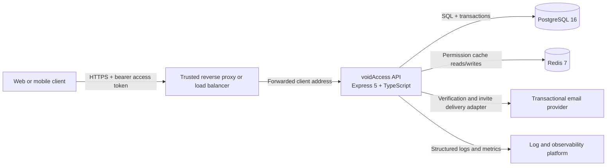
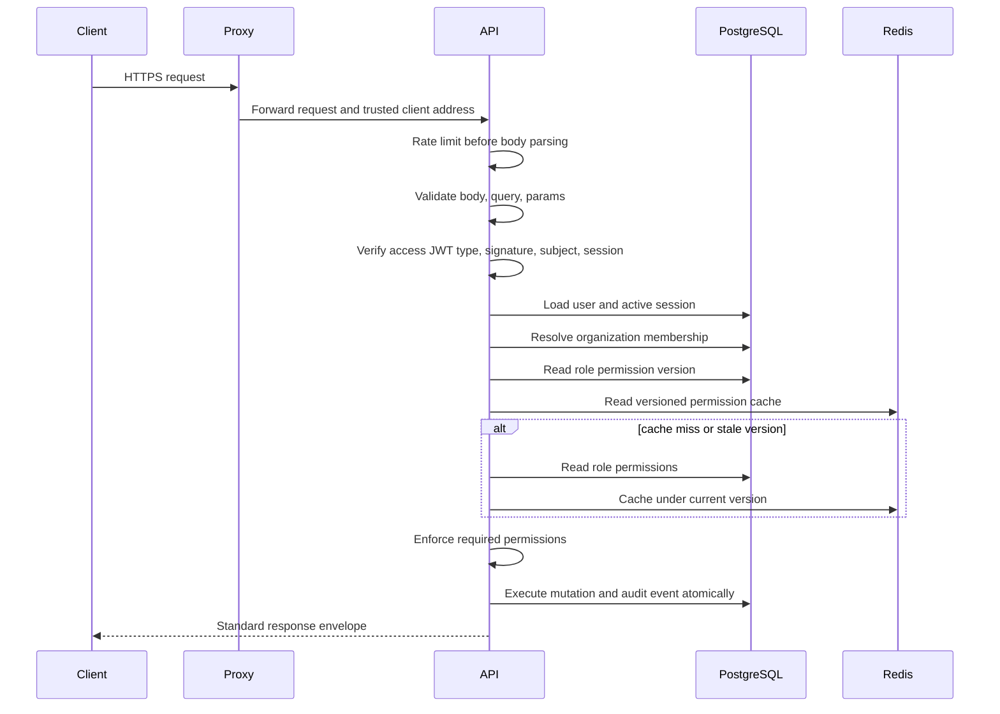

# voidAccess architecture

## Purpose

voidAccess is a multi-tenant team access-control API. It authenticates users, resolves organization membership, enforces role-based permissions, manages invitations, and records auditable mutations.

The authoritative system of record is PostgreSQL. Redis is required by the shared rate limiter and is an optional read-through cache for resolved role permissions; it must never grant access that PostgreSQL does not authorize.

## System context



The API must run behind a proxy only when `TRUST_PROXY_HOPS` is configured for the actual proxy chain. Leave it at `0` when the process receives client connections directly. The API derives actor IP and user-agent metadata from the request; it never accepts actor or ownership fields from the client.

## Runtime container view

```mermaid
flowchart TB
  subgraph Edge[Edge]
    Proxy[Reverse proxy / TLS termination]
  end
  subgraph App[Application process]
    HTTP[Express middleware pipeline]
    Routes[Route modules]
    Domain[Domain service modules]
    DB[Drizzle database adapter]
    Cache[Redis permission cache adapter]
    HTTP --> Routes --> Domain
    Domain --> DB
    Domain --> Cache
  end
  subgraph Data[Stateful dependencies]
    PG[(PostgreSQL])
    RD[(Redis)]
  end
  Proxy --> HTTP
  DB --> PG
  Cache --> RD
```

The database adapter is the transaction seam. Domain services receive the database executor, and multi-record mutations plus their audit event and email outbox row execute in one PostgreSQL transaction. A background worker claims outbox rows with `SKIP LOCKED`, sends through Resend, retries with exponential backoff, and clears terminal message bodies. An HTTP response is never the only delivery mechanism.

## Request and authorization flow



## Domain invariants

1. A user must have an active membership before a request can operate on an organization.
2. The organization `owner_id` is authoritative for ownership. The Owner's membership role is privileged, but role assignment cannot create a second organization owner.
3. System roles are shared and immutable. Custom roles are organization-scoped and may not use reserved system names.
4. A role cannot be deleted while a membership or pending invitation references it. PostgreSQL foreign keys use `RESTRICT` as the final race-safe guard.
5. Newly issued access and refresh tokens have different signing keys and explicit `typ` claims. Access authentication also requires an active, unexpired database session. Tokens issued before the claim was introduced remain accepted only during rollout because the signing keys are independent.
6. Refresh tokens rotate once. Reuse of a rotated-away token revokes active sessions for that user.
7. Verification and invitation tokens are stored only as SHA-256 hashes. Raw tokens are never logged or returned in production responses.
8. Every mutating action records an audit event in the same database transaction as the mutation. Verification and invitation mutations also enqueue their delivery in that transaction.
9. Organization audit records survive organization deletion with a null organization reference; actor references are nulled when a user is deleted.
10. Permission cache entries are versioned. A role permission update increments the database version, making old cache entries unreachable.
11. Retention cleanup removes terminal operational data after 30 days and audit logs after 365 days, in batches. A legal hold must override automatic deletion.

## Deployment topology

### Required production controls

- Terminate TLS at a managed proxy or load balancer.
- Restrict PostgreSQL and Redis to private network paths; the checked-in Compose file is loopback-only local development.
- Use a secrets manager for `JWT_SECRET` and `JWT_REFRESH_SECRET`. Generate independent values of at least 32 characters.
- Rate limits use the shared Redis store. Redis failures fail the limiter closed rather than allowing an untracked request flood; alert on Redis availability and latency.
- Run migrations as a release step before starting new application instances. The current `0003_snapshot.json` records the post-hardening schema; the historical `0002` migration predates snapshot metadata, so future schema changes should be reviewed against the migration SQL as well as the current snapshot.
- Configure structured log shipping, error alerting, database saturation alerts, and Redis failure alerts.
- Retention cleanup runs in bounded batches every hour by default. `RETENTION_TERMINAL_DAYS` defaults to 30 and `RETENTION_AUDIT_DAYS` defaults to 365. Legal-hold requirements override deletion.
- Integrate a durable email delivery adapter for verification and invitation messages. In development only, the API may return tokens to make local testing possible.

### Readiness and failure behavior

`/health` is liveness only. `/health/ready` verifies PostgreSQL. Redis is not an authorization dependency: startup may continue when Redis is unavailable, and permission resolution falls back to PostgreSQL. A Redis outage must appear in telemetry and must not cause the API to grant cached permissions without a current database role version.

## Security boundaries

- The client is untrusted. It cannot choose `actorId`, `ownerId`, organization ownership, or audit metadata.
- The reverse proxy is trusted only for the configured hop count. Incorrect proxy trust can corrupt IP-based rate limiting and audit attribution.
- PostgreSQL is authoritative for identity, membership, ownership, roles, invitations, and audit persistence.
- Redis is untrusted for authorization freshness. Cache values are validated against the current database permission version.
- Logs are security-sensitive. Authorization headers, cookies, passwords, refresh/access tokens, verification tokens, invitation tokens, and query strings are excluded or redacted.

## Decision register

| Decision | Rationale | Consequence |
| --- | --- | --- |
| PostgreSQL is authoritative | Strong constraints and transactions protect tenant and RBAC invariants | Permission checks may query PostgreSQL for a role version |
| Redis is optional | Cache failure must not take down authorization | Cache hit path adds a version read and eventual expiry is bounded |
| Versioned role permissions | A failed cache delete must not leave revoked permissions effective for the cache TTL | Permission updates increment `roles.permission_version` |
| Separate JWT keys and token types | A refresh token must never be accepted as an access token | Startup rejects equal or short signing secrets |
| Transactional audit writes | A successful mutation without its audit event violates the access-control contract | Audit insert failure rolls back the mutation |
| Membership-derived tenant context | Route ownership and membership are server-derived | Non-members receive a 404 tenant response |
| Restricted role foreign keys | Application checks alone have a check/delete race | Database rejects unsafe role deletion |
| Transactional email outbox | Provider availability must not invalidate committed account or invitation mutations | A worker and retention policy are required in addition to Resend credentials |
| Batched retention cleanup | Large cleanup jobs must not hold unbounded table locks or delete active operational data | Terminal data defaults to 30 days; audit data defaults to 365 days |
| Development token responses | Local integration needs a way to obtain verification and invite tokens | Production must use the Resend outbox worker |
